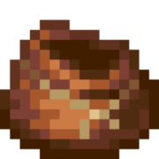

# How long, Mojang?
## [THIS PROJECT IS IN HIATUS UNTIL I BECOME INTERESTED IN MINECRAFT AGAIN]


## Demo Link
[Live Demo](http://MarshDeer.github.io/howlongmojang)

## Link here!
Wanna link to here? Copy this codeblock into your website to use the official 88x31 button!

```html
<a href="https://lensdeer.github.io/howlongmojang"></a>
```

## Countdown items
* Birch Forest overhaul
* Fireflies
* Bundles
* Archeology System
* Badlands (2019 Biome Vote)
* Combat Test Snapshots
* Fletching Table functionality
* Savannas and Deserts (2018 Biome Vote)
* Official Plugin API
* "Hurt Tilt" Bug

## Screenshot


## Inspiration
Loosely inspired by ["How long since Google said a Google Drive Linux client is coming](https://abevoelker.github.io/how-long-since-google-said-a-google-drive-linux-client-is-coming/) by [Abe Voelker](https://github.com/abevoelker)

## License
[Anti Capitalist Software License](https://anticapitalist.software/), because on second thought you can't trust corporations with public domain, can you?
