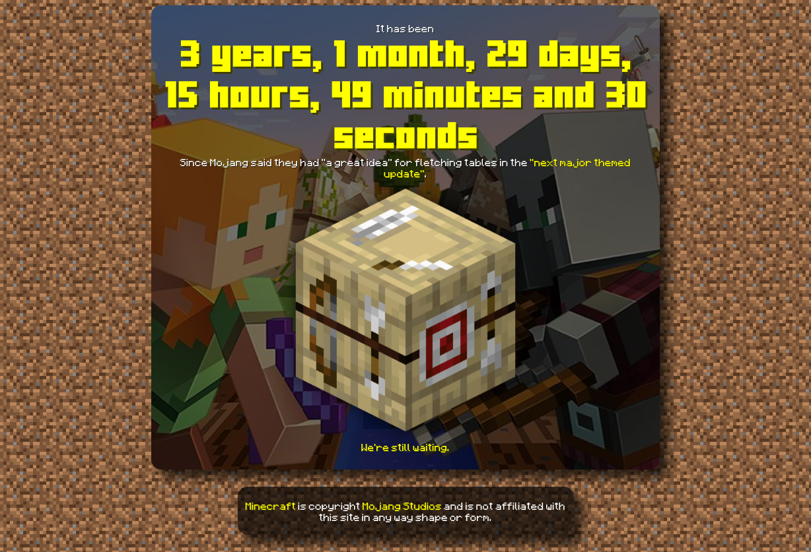

# How long, Mojang?
## Demo Link
[Live Demo](http://MarshDeer.github.io/howlongmojang)

## Countdown items
* Birch Forest overhaul
* Fletching Table functionality
* Official Plugin API
* "Hurt Tilt" Bug

## Screenshot

## Inspiration
Loosely inspired by ["How long since Google said a Google Drive Linux client is coming](https://abevoelker.github.io/how-long-since-google-said-a-google-drive-linux-client-is-coming/) by [Abe Voelker](https://github.com/abevoelker)

## License
[Anti Capitalist Software License](https://anticapitalist.software/), because on second thought you can't trust corporations with public domain, can you?
